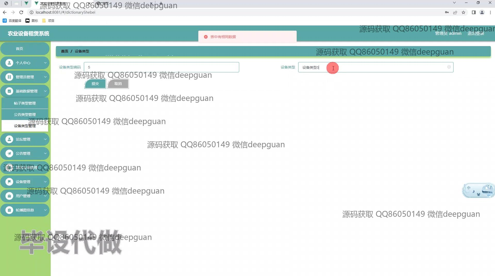

<h1 align="center">基于vue技术的农业设备租赁系统</h1>

## 简介
基于Vue和Spring Boot的农业设备租赁系统，支持管理员和用户角色，可实现设备租赁、订单管理、用户注册、论坛互动和个人信息管理等功能。    --计算机毕业设计源码；毕设源码；java毕业设计源码

## 联系方式

<h3 align="center">获取完整代码与数据库文件 + 微信：deepguan QQ: 86050149 QQ群: 783742310</h3>

<h3 align="center">可帮忙远程部署 包运行成功！提供远程部署、修改代码、设计文档指导、代码讲解等服务！</h3>

## 功能介绍（完整见运行截图）
管理员： 管理员可以登录和退出系统，通过主导航栏获取系统的主要功能模块，包括设备管理、用户管理、订单审核和留言管理等功能板块。在设备管理中，管理员能查看、编辑和删除设备信息，并管理设备类型分类。同时，管理员可以审核订单，填写物流信息，处理用户留言，维护站内公告信息。

用户： 用户可以注册、登录和退出系统，在网站首页通过导航栏访问各种功能模块。用户可以浏览农业设备列表，查看设备详情及库存信息，选择设备进行租赁并在线支付。同时，用户可以在个人中心中管理个人信息、收货地址和设备收藏，跟踪订单状态，查看历史租赁记录，并通过论坛进行信息交流和反馈。

## 运行截图

本代码来源于网络,仅供学习参考使用!

